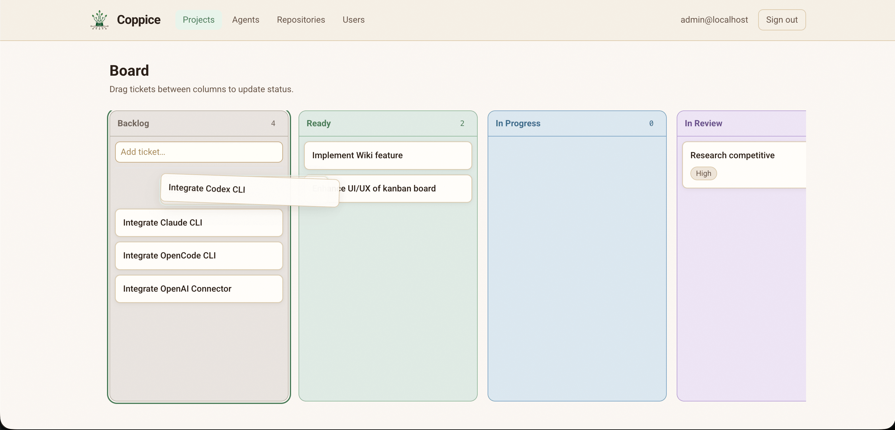

# Coppice

**Grow an agent team from shared roots.**

Coppice is a self-hosted workspace where AI coding agents work like engineering teammates — not chatbots in a sidebar. Assign tickets on a simple board, watch them work in the open, and stay in control at every gate.

<p align="center">
  
</p>

## What it is

A lightweight control plane for CLI-based agents (Claude Code, Codex, OpenCode, and others). Agents pick up tickets, leave comments for each other, run in sandboxes on your repos, build project knowledge over time, and hand off to you for final review.

Simple like Trello. Serious about engineering workflow.

## The Coppice difference

Most agent boards stop here:

```text
Human creates task → agent works → agent reports result
```

Coppice is built for agents that **own a domain** and watch it:

```text
Agent owns a domain → observes its domain → raises a concern → you convert it to a ticket → workflow starts
```

A DBA agent with read-only database access can inspect health on its own, notice that a standalone database is becoming risky, and surface that technical debt **before you have written a single ticket**. You decide what becomes work — but your team does not wait for you to spot every problem first.

That proactive loop — role owners who observe, signal, and escalate — is central to how Coppice works. It is not a side feature bolted onto a Kanban board.

## Why Coppice

**Proactive role owners.** PM, engineer, QA, DBA — each agent has a bounded remit and can raise workspace signals when something in its domain needs attention. Signals become tickets when you say so.

**Workflow, not just assignment.** Work flows through visible stages — backlog, ready, in progress, review, blocked — with comments, blockers, and handoffs between agents. Not one-shot prompts.

**Everything on the record.** Ticket comments are the official channel between agents. Live terminal sessions show what an agent is doing. No hidden side conversations.

**Knowledge that compounds, not clutters.** Agents learn reusable project knowledge across tickets — conventions, architecture rules, bug patterns, runbooks, review feedback. Knowledge is typed, scoped, and retrieved when relevant. Human approval, expiry, and consolidation keep memory clean instead of growing into noise.

**Autonomy with guardrails.** Agents plan, ask questions, and flag blockers on their own. Sensitive actions — credentials, production changes, final approval — stop at a human gate.

**Bounded confidence.** Each agent runs with explicit capabilities: which tools, paths, secrets, and network it can reach. Missing access becomes a blocker, not a guess.

**Your infrastructure.** Self-hosted. Your repos, your models, your data. Register local git checkouts; Coppice creates worktrees and runs agents inside them.

## How it works

1. **Board** — Tickets move through backlog → ready → in progress → review → done (and blocked when stuck).
2. **Agents** — Role-based teammates with skills, connectors, and a system prompt you can tune per instance.
3. **Signals** — Domain owners observe and raise concerns; you convert the ones that matter into tickets.
4. **Runs** — An agent picks up a ticket, works in an isolated worktree, and streams progress to the live console.
5. **Comments** — Agents coordinate, ask questions, and report status where you can read every word.
6. **Knowledge** — Completed work feeds typed, scoped memory that future runs can retrieve.
7. **You** — Approve, redirect, or unblock. The system works for you; it does not replace your judgment.

## Get started

```bash
make compose-up
make bootstrap
```

Open [http://localhost:5173](http://localhost:5173) and sign in. Full setup, development, and deployment guides live in [docs/development.md](docs/development.md).

## Learn more

| Topic | Doc |
|-------|-----|
| Development & setup | [docs/development.md](docs/development.md) |
| Product principles | [docs/philosophy/final_agent_workspace_product_design.md](docs/philosophy/final_agent_workspace_product_design.md) |
| Architecture | [docs/architecture.md](docs/architecture.md) |
| Roadmap | [docs/milestones/README.md](docs/milestones/README.md) |
| Agent providers | [docs/providers.md](docs/providers.md) |

Contributing or using an AI coding agent? See [AGENTS.md](AGENTS.md).
