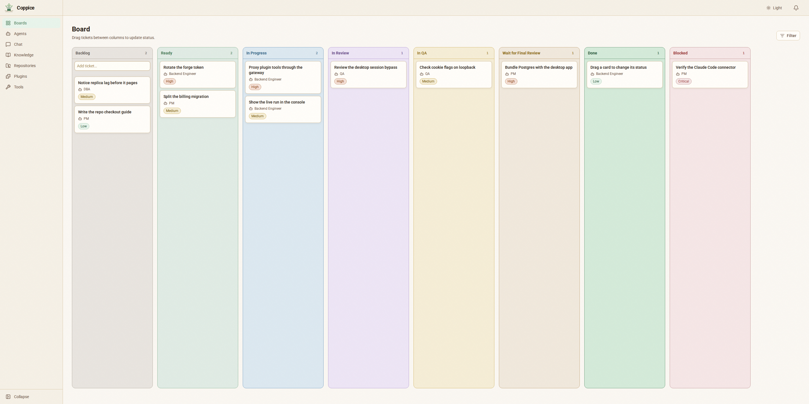

# Coppice

**Beta.** Run a team of coding agents without babysitting them.

  

**Stop babysitting agent terminals.** Queue work as tickets and let Claude Code, Codex and the rest build in parallel, each on its own branch. The board shows what's moving, what's stuck and what's waiting on you, and nothing counts as done until you've reviewed the diff. It runs on your machine with the agent CLIs you already pay for: no new subscription, no Coppice cloud, no Coppice account.

## The gates

Work stops for you in two places:

1. **Plan Review** (coming soon). A PM agent writes the plan. You approve it, or ask for changes in the ticket comments, before implementation starts.
2. **Wait for Human Review.** You review the diff. The ticket stays in this column until you accept it.

You start the work — create a ticket, or approve one an agent proposed. Agents plan and build between those gates.

## This beta

Installers for the beta are **macOS Apple Silicon** (`.dmg`) and **Linux x64** (`.deb`).

Stronger sandboxing for agents is coming in a later release. Role-owner agents that watch a domain and raise signals come after this beta. This beta is the gated board above.

Bring the CLIs you already use — Claude Code, Codex, Cursor, OpenCode and Kilo Code. Install and sign in to them the usual way. Coppice finds them on your login shell `PATH`. Mock agents are for automated tests and for Compose/dev builds that turn on the `mock-provider` feature. Desktop and release builds leave that feature off.

## Get started

Product docs are the site in [`website/`](website/): the landing page and the user guides. The public site is [https://getcoppice.vercel.app/](https://getcoppice.vercel.app/).

Download buttons go live when a beta git tag publishes GitHub Release assets for the `.dmg` and the `.deb`. Until that release exists, the site documents the install and leaves the download buttons inactive.

## Contributors

Docker Compose is how contributors and CI run the stack. Start with [AGENTS.md](AGENTS.md) and [docs/development.md](docs/development.md). The roadmap is [docs/milestones/README.md](docs/milestones/README.md).

## License

Coppice is open source under the [Apache 2.0 license](LICENSE).
