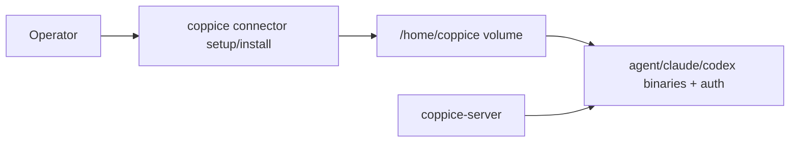

# M08 — Connector operator CLI (managed HOME)

## Goal

Operators enable, install, authenticate, and diagnose real agent CLIs with a **single Docker path**: a named volume at `/home/coppice` (`HOME`), `coppice` on PATH in the server image, and `coppice connector …` — **not** host `~/.local` / `~/.config` bind-mounts.

Default image stays **mock-only**. CI and smoke stay on mock.

## CLI surface

Extend the existing **`coppice`** binary (`cli/`):

```text
coppice connector list
coppice connector enable <id> [--config PATH]
coppice connector doctor <id>
coppice connector setup <id>     # vendor login (device-code / URL / paste-token)
coppice connector install <id>   # install into managed $HOME (cursor required; others as available)
```

| Command | Behavior |
|---------|----------|
| `list` | Known connectors + enabled? + binary on PATH? + short auth hint |
| `enable` | Patch `[agent.connectors.<id>]` (`enabled = true`, default `model_providers` / `command` when missing) |
| `doctor` | Binary on PATH, auth paths under `$HOME`, optional models probe; clear next steps |
| `setup` | Run the connector’s login command with inherited TTY |
| `install` | Install CLI into managed `$HOME` (e.g. `$HOME/.local/bin`) |

There is **no** `compose-snippet` product surface (that re-encoded host-mount workarounds).

## Auth matrix (`setup`)

| ID | Setup behavior |
|----|----------------|
| `cursor` | `agent login` — copy URL / complete in browser if printed |
| `codex` | `codex login --device-auth` |
| `claude-code` | Prefer `ANTHROPIC_API_KEY` or `claude setup-token` (paste). Browser OAuth is unreliable in headless containers; document limits |
| `opencode` | `opencode auth login` (vendor CLI / paste as required) |
| `kilo-code` | Vendor auth CLI / TUI `/connect` / paste instructions |
| `mock` | n/a — always healthy |

## Docker contract (single path)



- Named volume `connector_data` → `/home/coppice` (stable HOME)
- Compose sets `HOME=/home/coppice` and prepends `/home/coppice/.local/bin` to `PATH` (keep `/usr/sbin` for `gosu`)
- Ship `coppice` in the server image next to `coppice-server`
- Entrypoint preserves Compose `HOME`/`PATH` after `gosu` and chowns `$HOME` for `COPPICE_UID`
- **No** host bind-mount recipes in default docs or default compose

Operator loop:

```bash
docker compose -f deploy/docker-compose.yml exec -it -u "$(id -u):$(id -g)" server \
  coppice connector enable cursor
docker compose -f deploy/docker-compose.yml exec -it -u "$(id -u):$(id -g)" server \
  coppice connector install cursor
docker compose -f deploy/docker-compose.yml exec -it -u "$(id -u):$(id -g)" server \
  coppice connector setup cursor
docker compose -f deploy/docker-compose.yml exec -it -u "$(id -u):$(id -g)" server \
  coppice connector doctor cursor
```

Always target the **server** service (workers spawn CLIs there), never web.

## Out of scope

- Baking vendor CLIs into the default server image
- Host bind-mounts as a supported path
- Settings UI for connectors
- Finishing remaining M07 sandbox/signals work
- CI using real connectors (continue `MockProvider`)

## Architecture

```text
cli/src/commands/connector/
  mod.rs
  list.rs
  enable.rs
  doctor.rs
  setup.rs
  install.rs
  registry.rs   # per-id command, auth paths, setup/install adapters
```

`enable` writes `COPPICE_CONFIG` when set (Compose: `/etc/coppice/config.toml` → host `deploy/config/config.toml`), else `--config`, else the usual local/global path.

`install cursor` runs the upstream Cursor Agent installer into `$HOME` so `agent` lands on `$HOME/.local/bin`. Other connectors: install when a stable vendor script exists; otherwise print clear deferral / manual steps into managed HOME.

## Testing

- Unit: `enable` patches TOML idempotently; `doctor` non-zero when binary missing
- `cargo test -p coppice-cli`; `cargo clippy -p coppice-cli -- -D warnings`
- Manual: compose up → `doctor cursor` fails clearly until install/setup; after setup, models API works **without** host mounts

## Acceptance criteria

- [x] Docs no longer recommend host CLI bind-mount overrides; they point at `coppice connector …`
- [x] `coppice connector list|enable|doctor|setup` for all non-mock connectors
- [x] `coppice connector install cursor` works into managed `$HOME` (other IDs: clear “not yet / manual” message)
- [x] `coppice` binary on PATH in the server image
- [x] Compose: `connector_data` → `/home/coppice`, `HOME` + PATH as above
- [x] `enable` updates Docker/`COPPICE_CONFIG` correctly
- [x] `doctor` fails clearly when CLI or auth missing
- [x] Default `make compose-up` / CI smoke still mock-only
- [x] No `compose-snippet` command

## Related docs

- [docs/providers/README.md](../providers/README.md) — Docker Compose (managed connectors)
- [docs/development.md](../development.md)
- `cli/`, `deploy/docker-compose.yml`, `deploy/Dockerfile.server`
